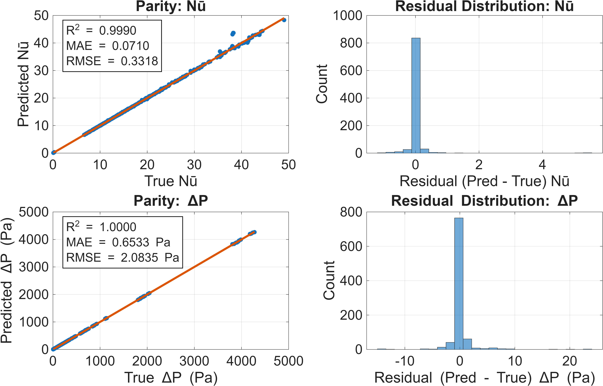

# Machine Learning–Accelerated Thermal-Hydraulic Prediction
### CFD → ML Surrogate Modeling for partially Porous Wavy Channel/liquid cold plate Heat Sinks

## Overview
This repository demonstrates an **industry-oriented machine learning surrogate model**
trained on **high-fidelity CFD simulations** to rapidly predict:

- **Average Nusselt number (Nū)**
- **Pressure drop–derived friction factor (f)**

for **laminar forced convection in porous wavy channels**.

The framework replaces thousands of expensive CFD runs with
**instant ML predictions**, enabling:
- fast design screening
- parametric studies
- optimization-ready workflows

> ⚠️ Raw CFD data and full trained models are intentionally excluded to protect
> unpublished research.

---

## Physics & CFD Background
- 2D sinusoidal channel geometry
- Partially porous slab
- Brinkman–Forchheimer momentum model
- Constant heat flux boundary condition
- Steady-state laminar flow

**Input parameters**
- Reynolds number (Re)
- Prandtl number (Pr)
- Darcy number (Da)
- Porosity (ε)
- Slab thickness (Hp)
- Wave amplitude (a)
- Wavelength (Lw)

---

## Dataset Summary
- **Base CFD simulations:** 768 cases  
- **Geometry expansion:** 6 configurations per case  
- **Total ML samples:** 4,608 (long-form dataset)

Each ML sample corresponds to a **unique thermo-hydraulic state**.

---

## Machine Learning Approach
- Algorithm: **Random Forest Regressor**
- Inputs:
Re, Pr, Da, ε, Hp, a, Lw

- Outputs:
Nū, friction factor (f) / Pressure drop

- Train/test split: 80% / 20%

---

## Model Performance (Test Set)
| Quantity | R² | MAE | RMSE |
|--------|----|-----|------|
| Nū | 0.999 | 0.071 | 0.331 |
| ΔP | 1.000 | 0.0007 | 0.002 |

Parity and validation plots confirm **excellent agreement** with CFD.

---

## Validation
- 10 unseen CFD cases selected randomly
- Errors consistently below **2%**
- Validation includes **dimensionless friction factor**
computed from ΔP

---

## Skills Demonstrated
- CFD-based data generation
- Physics-informed ML
- Random Forest regression
- Model validation & error analysis
- MATLAB ↔ Python workflows
- Engineering data visualization

---

## Applications
- EV battery and power electronics cooling
- High-heat-flux cold plate and liquid cooling design
- Electronics and semiconductor thermal management
- Data center and HPC liquid cooling optimization
- ML-accelerated CFD surrogate modeling
- Design space exploration and digital twin development
  
---

## Status
✔ Complete ML pipeline  
✔ Validated surrogate model  
✔ Journal manuscript in preparation  

---

## Contact
**Prince Kumar**  
Computational Thermal–Fluids | ML for Energy Systems  

